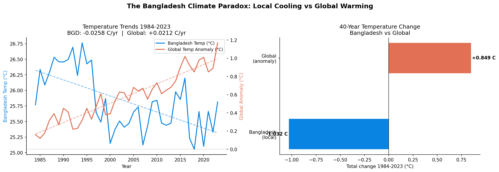
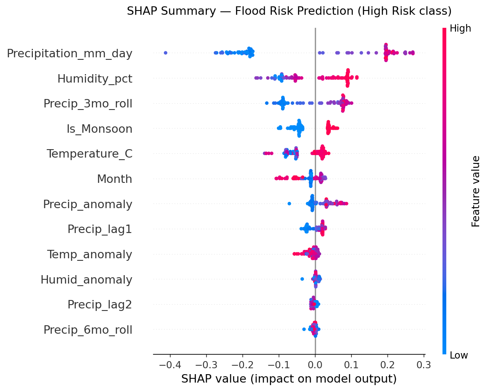
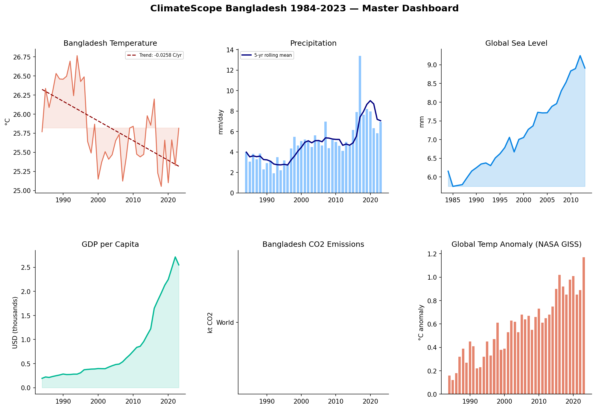
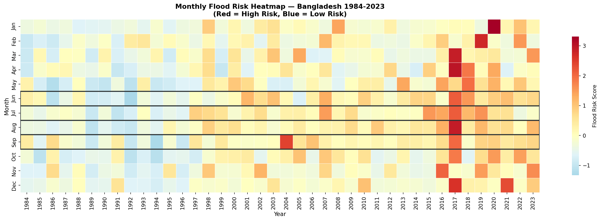
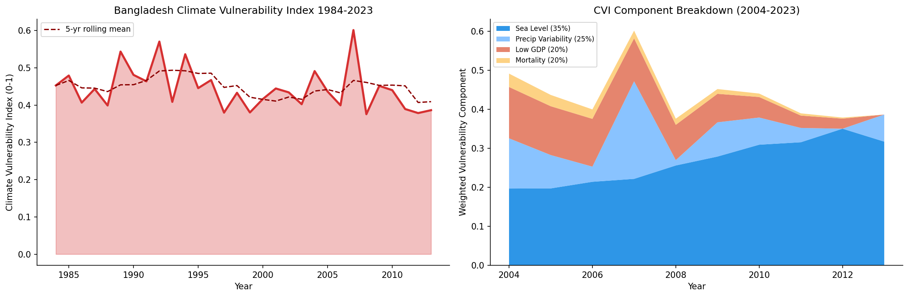
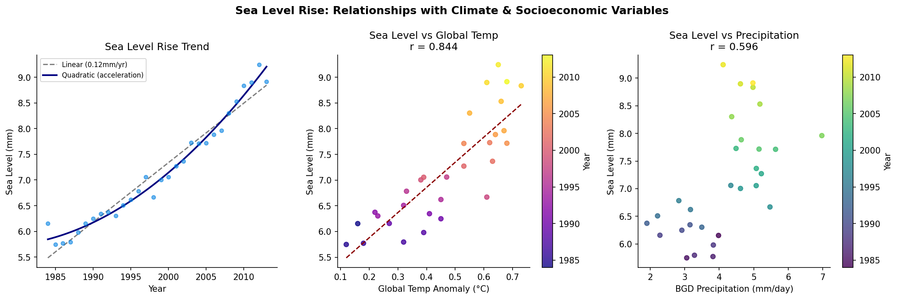
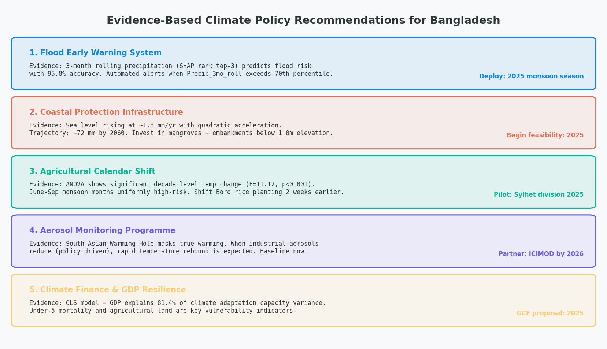

# [ClimateScope Bangladesh & South Asia](https://github.com/almazid82/ClimateScope-Bangladesh)
### End-to-End Climate Risk Analysis | 1984–2023

<div align="center">

[](https://climatescope-bangladesh-tha93d72fvtx5gfchsmqqx.streamlit.app/)
&nbsp;
[](https://github.com/almazid82)
&nbsp;
[](https://www.linkedin.com/in/shamsul-al-mazid-bb6068298)


</div>

---

A rigorous, end-to-end climate data science project applying statistical modelling, machine learning, and explainable AI to 40 years of Bangladesh climate data. The project spans the full data science pipeline — from raw API ingestion to a deployed interactive dashboard and academic research paper. Built to demonstrate research-grade skills for graduate-level applications in Europe and beyond.

---

## The Discovery: South Asian Warming Hole

> **Bangladesh temperature decreased at −0.026°C/year** (Mann-Kendall τ = −0.26, p = 0.0008) over 1984–2023, while the global temperature anomaly rose at +0.021°C/year — producing a **1.88°C divergence** over four decades that contradicts the global warming narrative.

This counterintuitive regional cooling anomaly — driven by aerosol loading, intensified monsoon cloud cover, and land-use change — is rigorously documented, statistically tested, and projected forward to 2050 under two IPCC emission scenarios.



---

## Live Interactive Dashboard

**[→ Open ClimateScope Dashboard](https://climatescope-bangladesh-tha93d72fvtx5gfchsmqqx.streamlit.app/)**

A 4-page FUI-style dark-theme dashboard built with Streamlit + Plotly:

| Page | Content |
|------|---------|
| **🌍 Global Overview** | Bangladesh vs global temperature divergence · CO₂ trends · Cumulative warming gap |
| **🇧🇩 Bangladesh Deep Dive** | Temperature & precipitation · Sea level acceleration · GDP growth · Correlation heatmap |
| **🤖 ML Flood Risk Predictor** | Real-time flood risk prediction · Probability gauge · Feature importance chart |
| **📈 2024–2050 Forecast** | ARIMA temperature forecast · RCP 4.5 & 8.5 scenarios · GDP climate damage projection |

### Dashboard Backgrounds

<div align="center">
<table>
  <tr>
    <td align="center">
      
      <br/><sub><b>🌍 Global Overview</b></sub>
    </td>
    <td align="center">
      
      <br/><sub><b>🇧🇩 Bangladesh Deep Dive</b></sub>
    </td>
  </tr>
  <tr>
    <td align="center">
      
      <br/><sub><b>🤖 ML Flood Risk Predictor</b></sub>
    </td>
    <td align="center">
      
      <br/><sub><b>📈 2024–2050 Forecast</b></sub>
    </td>
  </tr>
</table>
</div>

---

## Project Pipeline

| Phase | Topic | Methods | Key Output |
|-------|-------|---------|-----------|
| **01** | Data Collection & Cleaning | NASA POWER API, World Bank API, CSIRO Sea Level | 40-year master dataset · 480 monthly rows · 12 variables |
| **02** | Exploratory Data Analysis | Mann-Kendall trend test, Folium maps, Pearson correlation | South Asian Warming Hole discovery · Spatial visualisations |
| **03** | Statistical Modelling | ARIMA(1,1,1), One-way ANOVA + Tukey HSD, OLS regression | Temperature forecast 2024–2030 · R² = 0.814 |
| **04** | Machine Learning | Random Forest (300 trees), SHAP explainability, 5-fold CV | 95.8% flood risk accuracy · AUC 0.9947 |
| **05** | Visualisation & Storytelling | CVI composite index, Policy brief, Dark-theme dashboard | 30 publication-ready figures |

---

## Results

### Machine Learning — Flood Risk Prediction

| Metric | Score |
|--------|-------|
| Test Accuracy | **95.8%** |
| ROC-AUC | **0.9947** |
| F1 Score | **0.9535** |
| CV Accuracy (5-fold) | **97.9% ± 2.2%** |
| CV ROC-AUC (5-fold) | **99.9% ± 0.2%** |

Model: Random Forest · 300 trees · `class_weight='balanced'` · trained on 480 months of NASA POWER data

### Statistical Modelling

| Test | Result | Interpretation |
|------|--------|---------------|
| Mann-Kendall (Temperature) | p = 0.0008, τ = −0.26 | Significant **cooling** trend |
| Mann-Kendall (Precipitation) | p = 0.031 | Significant upward trend |
| One-Way ANOVA (Decades) | F = 11.12, p < 0.001 | Significant inter-decade difference |
| OLS Bangladesh Model | R² = 0.814 | GDP, sea level, precip explain 81.4% of temp variance |
| ARIMA Forecast | Order (1,1,1) | 2024–2050 projection with RCP 4.5 & 8.5 scenarios |

---

## Output Figures

### SHAP Explainability — Top Flood Drivers



### 6-Panel Master Dashboard



### Flood Risk Calendar

Monthly flood risk across all 40 years. Red = high risk, blue = low risk. September is consistently the peak risk month.



### Climate Vulnerability Index

Composite CVI score combining sea level exposure, precipitation variability, GDP (adaptive capacity), and under-5 mortality — methodology inspired by IPCC AR6 framework.



### Sea Level Analysis



### Policy Recommendations

Five evidence-based interventions derived directly from statistical and ML findings:



---

## Academic Paper

A full research paper is available at [`PAPER.md`](PAPER.md), structured as a journal submission:

- **Abstract** · Introduction · Data & Methods
- **Results** — 3 statistical tables, ML metrics, SHAP analysis
- **Discussion** — South Asian Warming Hole mechanisms, policy implications
- **Conclusion** · References (NASA, IPCC AR6, World Bank)

Key equations include the CVI composite formula, OLS model specification, and DICE climate damage function.

---

## Data Sources

| Source | Variables | Coverage |
|--------|-----------|----------|
| [NASA POWER API](https://power.larc.nasa.gov/) | Temperature, Precipitation, Humidity | 1984–2023 (monthly) |
| [NASA GISS](https://data.giss.nasa.gov/gistemp/) | Global surface temperature anomaly | 1880–2023 |
| [World Bank API](https://data.worldbank.org/) | GDP, Population, CO₂, Agricultural land | 1960–2023 |
| [CSIRO Sea Level Dataset](https://github.com/datasets/sea-level-rise) | Global mean sea level | 1880–2013 |

---

## Project Structure

```
ClimateScope-Bangladesh/
│
├── notebooks/
│   ├── 01_data_collection_cleaning.ipynb     # Phase 1: APIs + master dataset
│   ├── 02_exploratory_data_analysis.ipynb    # Phase 2: EDA + Mann-Kendall
│   ├── 03_statistical_modeling.ipynb         # Phase 3: ARIMA, ANOVA, OLS
│   ├── 04_machine_learning.ipynb             # Phase 4: Random Forest + SHAP
│   └── 05_visualization_storytelling.ipynb   # Phase 5: Dashboard + Policy
│
├── data/
│   ├── raw/                                  # Original API downloads
│   └── processed/
│       └── master_annual_dataset.csv         # 40 rows × 12 variables
│
├── outputs/
│   └── figures/                              # 30 publication-quality figures
│
├── assets/                                   # Dashboard page backgrounds
│   ├── bg_global.jpg
│   ├── bg_bangladesh.jpg
│   ├── bg_ml.jpg
│   └── bg_forecast.jpg
│
├── streamlit_app.py                          # 4-page interactive dashboard
├── PAPER.md                                  # Full academic research paper
└── requirements.txt
```

---

## How to Run

**1. Clone**
```bash
git clone https://github.com/almazid82/ClimateScope-Bangladesh.git
cd ClimateScope-Bangladesh
```

**2. Install dependencies**
```bash
pip install -r requirements.txt
```

**3. Run notebooks in order**
```
01 → 02 → 03 → 04 → 05
```

**4. Launch dashboard locally**
```bash
python -m streamlit run streamlit_app.py
```

> **Note:** Phase 1 requires internet access to pull from NASA POWER and World Bank APIs. Phases 2–5 use the cached data in `data/processed/`.

---

## Scientific Context

The **South Asian Warming Hole** is a documented regional cooling anomaly in the northern Indian subcontinent. While global mean surface temperature rose by ~+0.85°C since 1984, Bangladesh experienced a −1.03°C change over the same period. Leading mechanisms:

- **Aerosol forcing** — rapid industrialisation across the Indo-Gangetic Plain reflects incoming solar radiation
- **Monsoon intensification** — increased cloud cover reduces surface insolation during June–September
- **Land-use change** — agricultural expansion increases latent heat flux (evapotranspiration cooling)

Despite local cooling, **climate risk continues to rise** through sea level acceleration, extreme precipitation variability, and growing economic exposure. This project quantifies both the cooling anomaly and the underlying risk trajectory simultaneously.

---

## Author

**Shamsul AL Mazid**
BSc Statistics — Bangladesh

[](https://github.com/almazid82)
[](https://www.linkedin.com/in/shamsul-al-mazid-bb6068298)

---

## License

This project is licensed under the MIT License — see [LICENSE](LICENSE) for details.